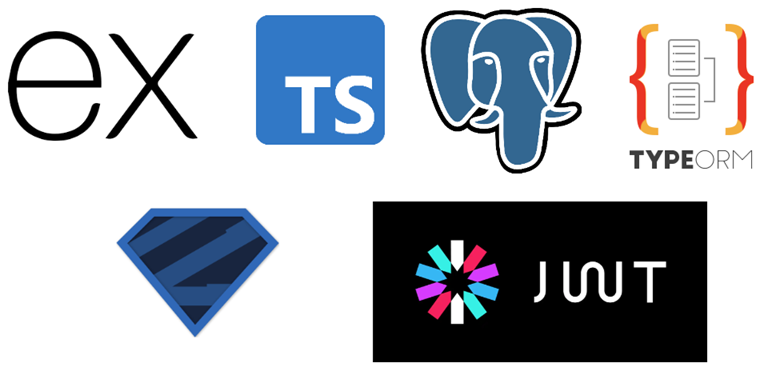

# ToDo List



# Tech stack
Describe the tech stack used to make this todo app.
1. ExpressJS
2. typeORM
3. postgresql
4. typescript

## etc Tech stack
#### Supporting microservices 
use docker to install etc techstack, the compose is provided as `docker-compose-etc.yml`
```bash
docker compose -f docker-compose-etc.yml up -d
```
1. postgresql
2. redis

# Data flow
```text
app -> routes -> middlewares -> controllers -> services -> repository -> database -> models
```

# Endpoints
## List of all endpoints

| Method | Endpoint                               | Auth | Payload                  | Response Example                  | Description                           |
| ------ | -------------------------------------- | ---- | ------------------------ | --------------------------------- | ------------------------------------- |
| POST   | `/register`                            | -    | `{ username, password }` | OK                                | Register a new user                   |
| POST   | `/login`                               | -    | `{ username, password }` | JWT                               | Login and receive JWT                 |
| GET    | `/todolists`                           | JWT  | –                        | status, message, data: todolist[] | Fetch all to-do lists                 |
| GET    | `/todolists/:todolistId`               | JWT  | –                        | status, message, data: todolist   | Get a single to-do list and its todos |
| POST   | `/todolists`                           | JWT  | `{ title }`              | status, message, data: todolist   | Create a new to-do list               |
| PUT    | `/todolists/:todolistId`               | JWT  | `{ title, status }`      | status, message, data: todolist   | Update a to-do list (title or status) |
| DELETE | `/todolists/:todolistId`               | JWT  | –                        | -                                 | Delete a to-do list                   |
| GET    | `/todolists/:todolistId/todos`         | JWT  | –                        | status, message, data: todo[]     | Fetch all todos in a list             |
| GET    | `/todolists/:todolistId/todos/:todoId` | JWT  | –                        | status, message, data: todo       | Get a single todo                     |
| POST   | `/todolists/:todolistId/todos`         | JWT  | `{ message }`            | status, message, data: todo       | Add a new todo to a list              |
| PUT    | `/todolists/:todolistId/todos/:todoId` | JWT  | `{ message, status }`    | status, message, data: todo       | Update a specific todo                |
| DELETE | `/todolists/:todolistId/todos/:todoId` | JWT  | –                        | status, message, data: NULL       | Delete a specific todo                |


## Status format
the status format is drived from http status with added information.
```
controller-http_status_code
xx-xxx
```